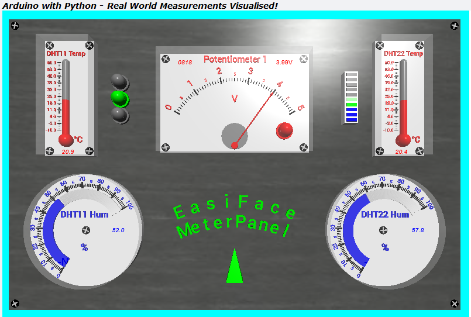

# TTB-AP-Lesson10
My Solution to Paul McWhorter's "Arduino with Python: LESSON 10" homework.

Visit Paul's video here:
 - https://youtu.be/watch?v=tJw8JEX89eo

You can get Paul's code here:
 - https://toptechboy.com/

You can see my solution demonstrated here:
 - https://youtu.be/jBbgi3pXZ-U

My Arduino sketch uses some simple multitasking with "millis()" to send and receive structured data to/from Python. The Python code now also has a tri-colour LED.

## My EasiFace Meter Panel - All OK:

